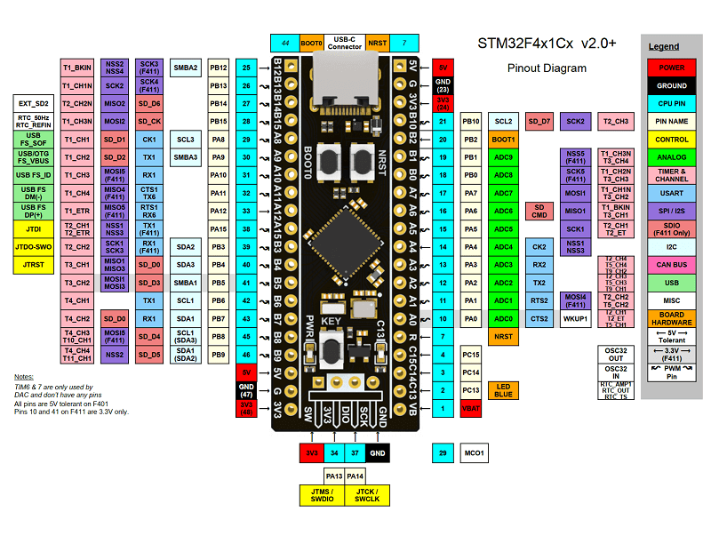

# Конфигурация платформы для MWOS

### Платформа: [WeAct Studio BlackPill V2.0 (STM32F411CE)](https://stm32-base.org/boards/STM32F411CEU6-WeAct-Black-Pill-V2.0.html)

Характеристики:

- [ ] STM32F411CE - 100MHz, USB-C, 128Kb ROM, 512Kb FLASH, 31 backup registers in RTC, 32 programmable GPIOs
- большая часть портов толерантна к 5в

## PINOUT:

