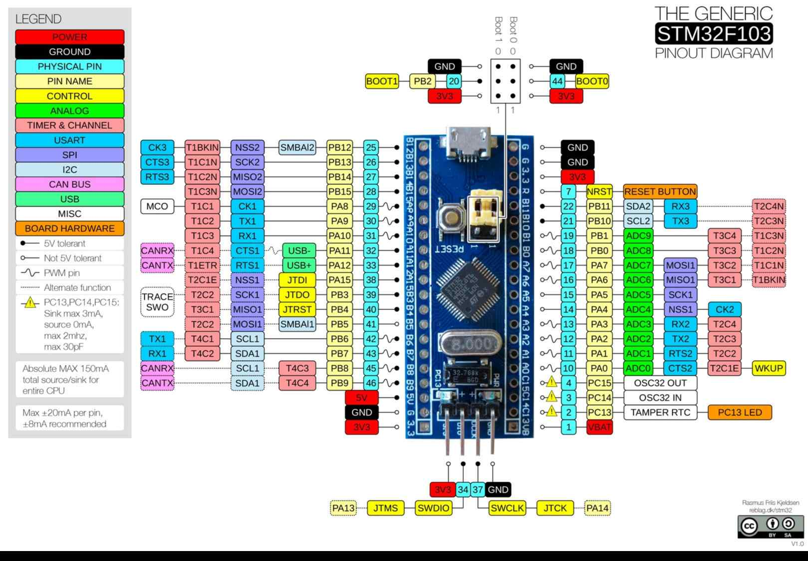

# Конфигурация платформы для MWOS

### Платформа: [STM32F103C8T6-Blue-Pill](https://stm32-base.org/boards/STM32F103C8T6-Blue-Pill.html)

Характеристики:

- [ ] STM32F103C8/B - 72MHz, USB, 20Kb ROM, 64Kb/128Kb FLASH, 31 backup registers in RTC, 26 programmable GPIOs

- 26 портов (пододящие для ключей - 16шт и цифровых входов - 15шт, аналоговых входов - 10шт)
- PB5,PB6,PB7,PB8,PB9,PB12,PB13,PB14,PB15, PC13(только ключ),PB9,PB10,PB11,PA8,PA9,PA10
- не работают(!): PB3,PB4,PA11,PA12,PA15, PC14,PC15
- PA12/PA11 подключены к D+/D- USB, их лишний раз лучше вообще не трогать!
- пододящие для аналоговых входов (10шт): PA0,PA1,PA2,PA3,PA4,PA5,PA6,PA7,PB0,PB1 (все проверены!)
- PA9,PA10 - для связи с ESP8266, если подключен как слейв
- PA4,PA5,PA6,PA7 - для связи через LAN-модуль
- большая часть портов толерантна к 5в

## PINOUT:

