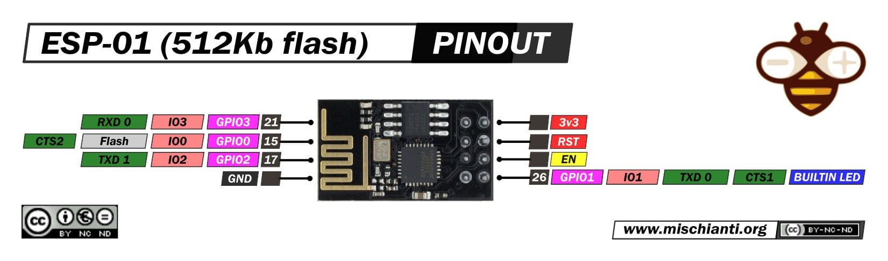

# 📋 ESP-01 / ESP-01S

### Платформа: [ESP8266EX](https://www.espressif.com/en/products/socs/esp8266)

**Плюсы:** Самая низкая цена на рынке, ультракомпактный размер (14.3×24.8×3 мм), низкое энергопотребление (deep sleep ~20 мкА), встроенный Wi-Fi 802.11 b/g/n для базовых IoT-задач, простая архитектура для обучения, широкая поддержка в Arduino IDE и MicroPython, идеален для простых реле, кнопок, датчиков и прототипирования.

**Минусы:** Всего 2 usable GPIO (GPIO0, GPIO2), нет USB (требуется внешний USB-to-UART адаптер), только 512 КБ–1 МБ Flash (недостаточно для MWOS-разметки), нет Bluetooth, одно ядро 80 МГц, мало RAM (64+96 КБ), 10-бит ADC с одним каналом, нет аппаратного шифрования/Secure Boot, GPIO не 5В tolerant, требует внешних подтяжек и стабилизации питания, устаревшая архитектура (2014), ограниченная поддержка современных библиотек.

**Основные параметры:** ESP8266EX (Tensilica Xtensa LX106, 80 МГц), 64 КБ instruction RAM + 96 КБ data RAM, Flash 512 КБ–1 МБ, PSRAM отсутствует.

**Беспроводная связь:** Wi-Fi 802.11 b/g/n (2.4 ГГц), антенна PCB (ESP-01) или внешняя (ESP-01S с разъёмом IPEX).

**Интерфейсы и GPIO:** 2 usable GPIO (GPIO0, GPIO2), 1×UART (TX/RX), 1×10-бит ADC (TOUT, 0–1В), PWM на GPIO, 1-Wire, 3.3 В выход.

**Питание:** 3.3 В напрямую (рекомендуется внешний стабилизатор); ток: TX ~250–350 мА (пики), RX ~70 мА, deep sleep ~20 мкА.

**Безопасность:** WPA/WPA2, базовое шифрование Wi-Fi, нет аппаратного шифрования flash или Secure Boot.

**Особенности платы:** Кнопка RESET отсутствует (требуется внешняя), GPIO0 и EN для входа в режим прошивки, требует внешних подтяжек (GPIO0, GPIO2, CH_PD), компактный 8-пиновый DIP-совместимый корпус.

**Примерная цена:** $1–2 (≈80–200 ₽) в зависимости от продавца и версии (ESP-01 / ESP-01S).

### Варианты исполнения

| Модель  | Модуль | Flash        |
|---------|--------|--------------|
| ESP-01  | ESP8266 | 512 КБ–1 МБ |
| ESP-01S | ESP8266 | 1 МБ        |

> 💡 **Примечание:** ESP-01/ESP-01S имеет слишком мало Flash (512 КБ–1 МБ) для стандартной MWOS-разметки (требуется минимум 4 МБ). Для полноценной работы с OTA, littleFS и NVS рекомендуется использовать ESP8266-модули с 4 МБ Flash (NodeMCU, Wemos D1 Mini) или перейти на ESP32.

> ⚠️ **Важно:** Для прошивки соединить GPIO0 с GND, подать питание, затем нажать RESET. Для нормальной работы GPIO0 и GPIO2 должны быть подтянуты к VCC.
> 

## PINOUT:

