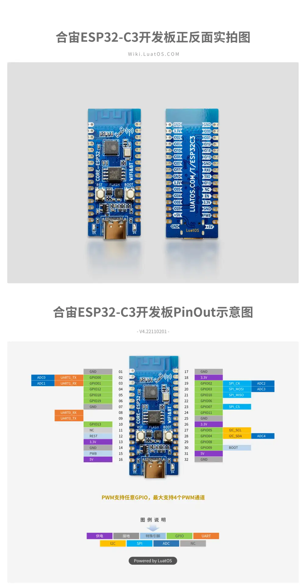

# 📋 esp32-c3-LuatOS

### Платформа: [esp32-c3-LuatOS](https://wiki.luatos.org/chips/esp32c3/board.html)

### ESP32-C3 - рекомендуем для мобильных контроллеров!

**Плюсы:** Отличное соотношение цены и качества, архитектура RISC-V (открытая лицензия), самое низкое энергопотребление (deep sleep ~8 мкА), встроенный Wi-Fi + Bluetooth 5.0 LE, нативный USB OTG (без внешнего чипа), аппаратное шифрование и Secure Boot, поддержка LuatOS и Arduino, компактный корпус, подходит для бюджетных IoT-устройств.

**Минусы:** Одно ядро (меньшая многозадачность vs dual-core), максимальная частота 160 МГц (ниже чем у S3/ESP32), меньше GPIO (ок. 22 программируемых), нет Bluetooth Classic (только BLE), меньше SRAM (400 КБ), нет Ethernet MAC, нет DAC, ADC требует калибровки, GPIO не 5В tolerant.

**Основные параметры:** ESP32-C3 (RISC-V 32-bit, до 160 МГц), 400 КБ SRAM, Flash 4–16 МБ, PSRAM обычно отсутствует (зависит от модуля).

**Беспроводная связь:** Wi-Fi 802.11 b/g/n (2.4 ГГц) + Bluetooth 5.0 LE, антенна PCB.

**Интерфейсы и GPIO:** ~22 GPIO, 3×SPI, 2×UART, 1×I2C, 1×I2S, 6×ADC (12-бит), PWM, RMT, TWAI (CAN), USB OTG.

**Питание:** 5 В USB → 3.3 В; ток: TX ~250 мА, RX ~80 мА, light sleep ~150 мкА, deep sleep ~8 мкА.

**Безопасность:** Secure Boot, Flash Encryption, аппаратное ускорение AES-128/256, SHA, RSA, ECC, HMAC, RNG.

**Особенности платы:** кнопки Boot/Reset, нативный USB (Type-C или Micro), RGB LED (часто на GPIO8), все GPIO выведены на разъёмы, поддержка отладки через USB.

**Примерная цена:** $1.5–3 (≈120–400 ₽) в зависимости от конфигурации Flash.

### Варианты исполнения и размер разделов в MWOS

| Модель  | Модуль | Flash  | PSRAM | app0 | littleFS | nvs | nvs1 |
|---------|--------|--------|-------|---------|----------|-----|------|
| C3-4MB  | C3-MINI-1 | 4 МБ   | — | 1.81 МБ | 32 КБ | 192 КБ | 32 КБ |
| C3-8MB  | C3-MINI-1 | 8 МБ   | — | 1.81 МБ | 4.03 МБ | 192 КБ | 32 КБ |
| C3-16MB | C3-MINI-1 | 16 МБ  | — | 1.81 МБ | 12.03 МБ | 192 КБ | 32 КБ |

> 💡 **Примечание:** Указаны рекомендуемые для MWOS размеры разделов (app0 и app1 - одинаковы). Для 4 МБ Flash spiffs минимален (32 КБ). ESP32-C3 обычно не имеет внешней PSRAM.

## PINOUT:

