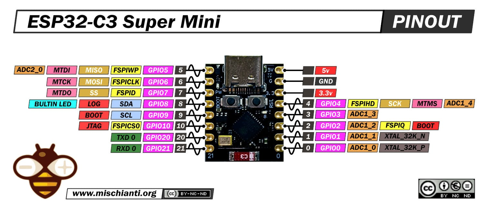

# 📋 ESP32-C3-SuperMini

### Платформа: [ESP32-C3-SuperMini](https://docs.espressif.com/projects/esp-idf/en/latest/esp32c3/hw-reference/esp32c3/user-guide-devkitc-1.html)

**Плюсы:** Отличное соотношение цены и качества, ультракомпактный размер (25×18×8 мм), архитектура RISC-V (открытая лицензия), низкое энергопотребление (deep sleep ~8 мкА), встроенный Wi-Fi + Bluetooth 5.0 LE, нативный USB-C (без внешнего чипа), аппаратное шифрование и Secure Boot, поддержка Arduino/LuatOS/MicroPython, идеален для миниатюрных IoT-устройств и носимой электроники.

**Минусы:** Одно ядро (ограниченная многозадачность), частота до 160 МГц (ниже чем у S3/ESP32), мало GPIO (ок. 15–18, не все выведены), нет Bluetooth Classic (только BLE), нет PSRAM, меньше SRAM (400 КБ), нет Ethernet MAC, нет DAC, ADC требует калибровки, GPIO не 5В tolerant, компактный размер усложняет пайку и подключение проводов.

**Основные параметры:** ESP32-C3 (RISC-V 32-bit, до 160 МГц), 400 КБ SRAM, Flash 4–16 МБ, PSRAM обычно отсутствует.

**Беспроводная связь:** Wi-Fi 802.11 b/g/n (2.4 ГГц) + Bluetooth 5.0 LE, антенна PCB.

**Интерфейсы и GPIO:** ~15–18 GPIO, 2×SPI, 2×UART, 1×I2C, 6×ADC (12-бит), PWM, RMT, TWAI (CAN, на некоторых пинах), USB OTG.

**Питание:** 5 В USB-C → 3.3 В (LDO); ток: TX ~250 мА, RX ~80 мА, light sleep ~150 мкА, deep sleep ~8 мкА.

**Безопасность:** Secure Boot, Flash Encryption, аппаратное ускорение AES-128/256, SHA, RSA, ECC, HMAC, RNG.

**Особенности платы:** кнопки Boot/Reset, USB-C разъём, RGB LED (часто на GPIO8), компактный форм-фактор, все GPIO выведены на боковые контакты.

**Примерная цена:** $1.5–3 (≈120–300 ₽) в зависимости от конфигурации Flash.

### Варианты исполнения и размер разделов в MWOS

| Модель  | Модуль | Flash  | PSRAM | app0 | littleFS | nvs | nvs1 |
|---------|--------|--------|-------|---------|----------|-----|------|
| C3-SM-4MB  | C3-MINI-1 | 4 МБ   | — | 1.81 МБ | 32 КБ | 192 КБ | 32 КБ |
| C3-SM-8MB  | C3-MINI-1 | 8 МБ   | — | 1.81 МБ | 4.03 МБ | 192 КБ | 32 КБ |
| C3-SM-16MB | C3-MINI-1 | 16 МБ  | — | 1.81 МБ | 12.03 МБ | 192 КБ | 32 КБ |

> 💡 **Примечание:** Указаны рекомендуемые для MWOS размеры разделов (app0 и app1 - одинаковы). Для 4 МБ Flash spiffs минимален (32 КБ). ESP32-C3-SuperMini обычно не имеет внешней PSRAM.

## PINOUT:

