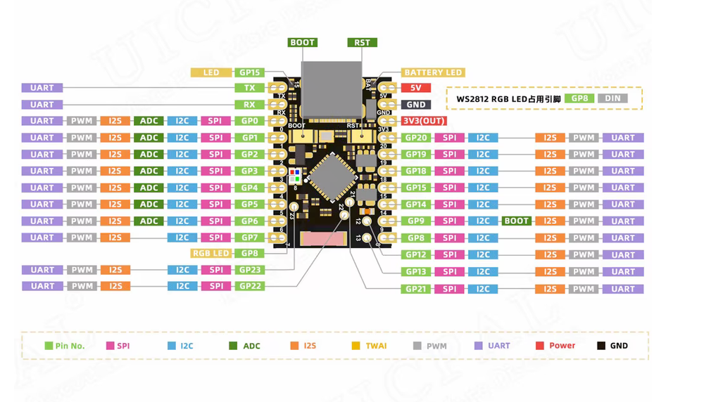

# 📋 ESP32-C6-SuperMini

### Платформа: [ESP32-C6-DevKit](https://docs.espressif.com/projects/esp-idf/en/latest/esp32c6/hw-reference/esp32c6/user-guide-devkitc-1.html)

**Плюсы:** Отличное соотношение цены и качества, 22 GPIO, поддержка Wi-Fi 6 (802.11ax) для лучшей работы в загруженных сетях, Bluetooth 5.3 LE + Zigbee + Thread (Matter-ready) для умного дома, архитектура RISC-V (открытая лицензия), низкое энергопотребление (deep sleep ~5–10 мкА), нативный USB-C, аппаратное шифрование и Secure Boot, поддержка Arduino/LuatOS/MicroPython, ультракомпактный размер идеален для миниатюрных IoT-устройств.

**Минусы:** Одно ядро (ограниченная многозадачность), частота до 160 МГц (ниже чем у S3), нет Bluetooth Classic, нет PSRAM, меньше SRAM (512 КБ), нет Ethernet MAC, нет DAC, ADC требует калибровки, GPIO не 5В tolerant, компактный размер усложняет пайку, Wi-Fi 6 преимущества раскрываются только с совместимым роутером.

**Основные параметры:** ESP32-C6 (RISC-V 32-bit, до 160 МГц), 512 КБ SRAM + 384 КБ ROM, Flash 4–32 МБ, PSRAM обычно отсутствует.

**Беспроводная связь:** Wi-Fi 6 802.11ax (2.4 ГГц) + Bluetooth 5.3 LE + IEEE 802.15.4 (Zigbee/Thread/Matter), антенна PCB.

**Интерфейсы и GPIO:** ~15–20 GPIO, 3×SPI, 2×UART, 1×I2C, 1×I2S, 6×ADC (12-бит), PWM, RMT, TWAI (CAN), USB OTG.

**Питание:** 5 В USB-C → 3.3 В (LDO); ток: TX ~220 мА, RX ~70 мА, light sleep ~120 мкА, deep sleep ~5–10 мкА.

**Безопасность:** Secure Boot, Flash Encryption, аппаратное ускорение AES-128/256, SHA-2, RSA-3072, ECC, HMAC, цифровая подпись, RNG, 4 Кбит OTP.

**Особенности платы:** кнопки Boot/Reset, USB-C разъём, RGB LED (часто на GPIO8), ультракомпактный форм-фактор (~25×18×8 мм), все GPIO выведены на боковые контакты, поддержка Matter/Zigbee/Thread.

**Примерная цена:** $2.5–6 (≈220–600 ₽) в зависимости от конфигурации Flash.

### Варианты исполнения и размер разделов в MWOS

| Модель  | Модуль | Flash  | PSRAM | app0 | littleFS | nvs | nvs1 |
|---------|--------|--------|-------|---------|----------|-----|------|
| C6-SM-4MB  | C6-MINI-1 | 4 МБ   | — | 1.81 МБ | 32 КБ | 192 КБ | 32 КБ |
| C6-SM-8MB  | C6-MINI-1 | 8 МБ   | — | 1.81 МБ | 4.03 МБ | 192 КБ | 32 КБ |
| C6-SM-16MB | C6-MINI-1 | 16 МБ  | — | 1.81 МБ | 12.03 МБ | 192 КБ | 32 КБ |
| C6-SM-32MB | C6-MINI-1 | 32 МБ  | — | 1.81 МБ | 28.0 МБ | 192 КБ | 32 КБ |

> 💡 **Примечание:** Указаны рекомендуемые для MWOS размеры разделов (app0 и app1 - одинаковы). Для 4 МБ Flash spiffs минимален (32 КБ). ESP32-C6-SuperMini обычно не имеет внешней PSRAM. Поддержка Zigbee/Thread требует соответствующей прошивки.

## PINOUT:

