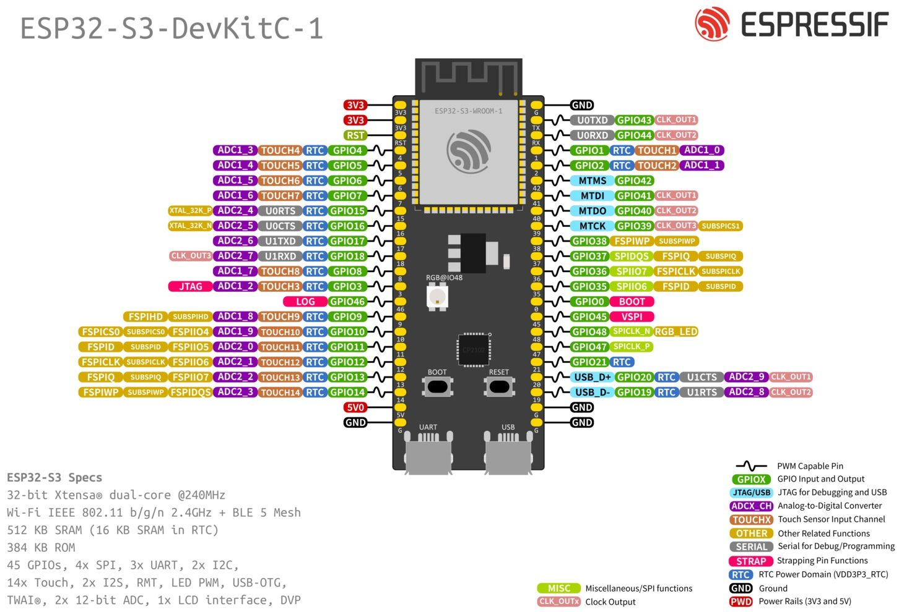

# 📋 ESP32-S3-DevKitC-1

### Платформа: [ESP32-S3-DevKitC-1](https://docs.espressif.com/projects/esp-idf/en/latest/esp32s3/hw-reference/esp32s3/user-guide-devkitc-1.html)

### ESP32-S3 - рекомендуем для стационарных контроллеров!

**Плюсы:** Лучшее соотношение цены и качества, низкое энергопотребление (deep sleep ~8 мкА), встроенный Wi-Fi + BLE 5.0 для гибкой связи, аппаратное шифрование и Secure Boot для безопасности, USB OTG и богатый набор интерфейсов (SPI, UART, I2C, CAN) для подключения датчиков и периферии, поддержка AI/ML-инструкций для обработки данных на краю сети, OTA-обновления через двойной банк прошивок.

**Минусы:** Только 2.4 ГГц Wi-Fi (нет 5 ГГц), нет Bluetooth Classic (только BLE 5.0), ADC требует калибровки (невысокая точность по умолчанию), GPIO не 5В tolerant (только 3.3В), нет встроенного Ethernet (требуется внешний чип), может перегреваться при высокой нагрузке без радиатора, USB только Device/OTG (нет полноценного Host), сложность отладки для новичков по сравнению с Arduino.

**Основные параметры:** ESP32-S3 (2×LX7, до 240 МГц), 512 КБ SRAM + 384 КБ ROM, Flash 8–32 МБ, PSRAM опционально 2–16 МБ.

**Беспроводная связь:** Wi-Fi 802.11 b/g/n (2.4 ГГц) + Bluetooth 5.0 LE, антенна PCB или разъём U.FL (-1U).

**Интерфейсы и GPIO:** 45 GPIO, 4×SPI, 3×UART, 2×I2C, 2×I2S, 14 touch, 2×12-бит ADC, USB OTG, LED PWM, RMT, PCNT, TWAI® (CAN).

**Питание:** 5 В USB → 3.3 В; ток: TX 285–355 мА, RX ~95 мА, light sleep ~240 мкА, deep sleep ~8 мкА.

**Безопасность:** Secure Boot, Flash Encryption, аппаратное ускорение AES/SHA/RSA, 4 Кбит OTP.

**Особенности платы:** кнопки Boot/Reset, RGB LED (GPIO48), все GPIO выведены на разъёмы, JTAG через USB.

**Примерная цена:** $4–9 (≈350–900 ₽) в зависимости от конфигурации Flash/PSRAM.

### Варианты исполнения и размер разделов в MWOS

| Модель  | Модуль | Flash  | PSRAM | SPI V | app0 | littleFS | nvs | nvs1 |
|---------|--------|--------|-------|-------|---------|----------|-----|------|
| N8      | WROOM-1-N8 | 8 МБ   | — | 3.3 В | 1.81 МБ | 4.03 МБ  | 192 КБ | 32 КБ |
| N8R2    | WROOM-1-N8R2 | 8 МБ   | 2 МБ | 3.3 В | 1.81 МБ | 4.03 МБ  | 192 КБ | 32 КБ |
| N8R8    | WROOM-1-N8R8 | 8 МБ   | 8 МБ | 3.3 В | 1.81 МБ | 4.03 МБ  | 192 КБ | 32 КБ |
| N16R8V  | WROOM-2-N16R8V | 16 МБ  | 8 МБ | 1.8 В | 1.81 МБ | 12.03 МБ | 192 КБ | 32 КБ |
| N32R8V  | WROOM-2-N32R8V | 32 МБ  | 8 МБ | 1.8 В | 1.81 МБ | 28.0 МБ  | 192 КБ | 32 КБ |

> 💡 **Примечание:** Указаны рекомендуемые для MWOS размеры разделов (app0 и app1 - одинаковы).

## PINOUT:

