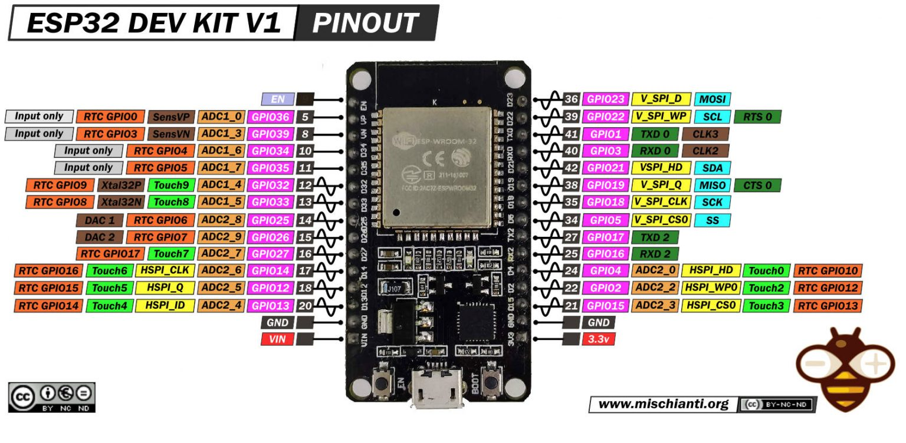

# 📋 ESP32-DevKit-V1

### Платформа: [ESP32-DevKit-V1](https://docs.espressif.com/projects/esp-dev-kits/en/latest/esp32/esp32-devkitm-1/index.html)

### Рекомендуется по возможности заменить на ESP32-S3

**Плюсы:** Отличное соотношение цены и качества, низкое энергопотребление (deep sleep ~10 мкА), встроенный Wi-Fi + Bluetooth 4.2 (Classic + BLE) для гибкой связи, два ядра Xtensa LX6 до 240 МГц, богатый набор интерфейсов (SPI, UART, I2C, I2S, CAN) для подключения датчиков и периферии, 38 GPIO пинов, аппаратное ускорение криптографии, OTA-обновления через двойной банк прошивок, широкая поддержка в Arduino IDE и PlatformIO.

**Минусы:** Старая архитектура (2016), нет новых AI/ML-инструкций, Bluetooth Classic может создавать помехи Wi-Fi, ADC требует калибровки (невысокая точность по умолчанию), GPIO не 5В tolerant (только 3.3В), нет нативного USB (только UART через CP2102/CH340), меньше GPIO выведено на плату по сравнению с S3, нет USB OTG, чуть выше энергопотребление в sleep-режимах vs S3. Много аппаратных проблем.

**Основные параметры:** ESP32 (2×LX6, до 240 МГц), 520 КБ SRAM, Flash 4–32 МБ, PSRAM опционально 4–8 МБ (на некоторых модификациях).

**Беспроводная связь:** Wi-Fi 802.11 b/g/n (2.4 ГГц) + Bluetooth v4.2 BR/EDR и BLE, антенна PCB.

**Интерфейсы и GPIO:** 38 GPIO (не все выведены), 4×SPI, 3×UART, 2×I2C, 2×I2S, 10×ADC (12-бит), 2×DAC (8-бит), LED PWM (16 каналов), RMT, PCNT, TWAI (CAN), USB-to-UART (CP2102/CH340).

**Питание:** 5 В USB → 3.3 В (LDO); ток: TX ~250 мА, RX ~100 мА, light sleep ~0.8 мА, deep sleep ~10 мкА.

**Безопасность:** Flash Encryption, аппаратное ускорение AES/SHA/RSA/ECC, RNG, 1024 бит OTP.

**Особенности платы:** кнопки EN (Reset) и BOOT для прошивки, USB-to-UART преобразователь (CP2102 или CH340), индикатор питания, все основные GPIO выведены на штыревые разъёмы.

**Примерная цена:** $3–8 (≈300–800 ₽) в зависимости от конфигурации Flash/PSRAM.

### Варианты исполнения и размер разделов в MWOS

| Модель  | Модуль | Flash  | PSRAM | app0 | littleFS | nvs | nvs1 |
|---------|--------|--------|-------|---------|----------|-----|------|
| V1-4MB  | WROOM-32 | 4 МБ   | — | 1.81 МБ | 32 КБ | 192 КБ | 32 КБ |
| V1-8MB  | WROOM-32 | 8 МБ   | — | 1.81 МБ | 4.03 МБ | 192 КБ | 32 КБ |
| V1-16MB | WROOM-32 | 16 МБ  | — | 1.81 МБ | 12.03 МБ | 192 КБ | 32 КБ |
| V1-32MB | WROOM-32 | 32 МБ  | — | 1.81 МБ | 28.0 МБ | 192 КБ | 32 КБ |

> 💡 **Примечание:** Указаны рекомендуемые для MWOS размеры разделов (app0 и app1 - одинаковы). Для 4 МБ Flash spiffs минимален (32 КБ), рекомендуется использовать 8+ МБ версии для больших проектов.

## PINOUT:

