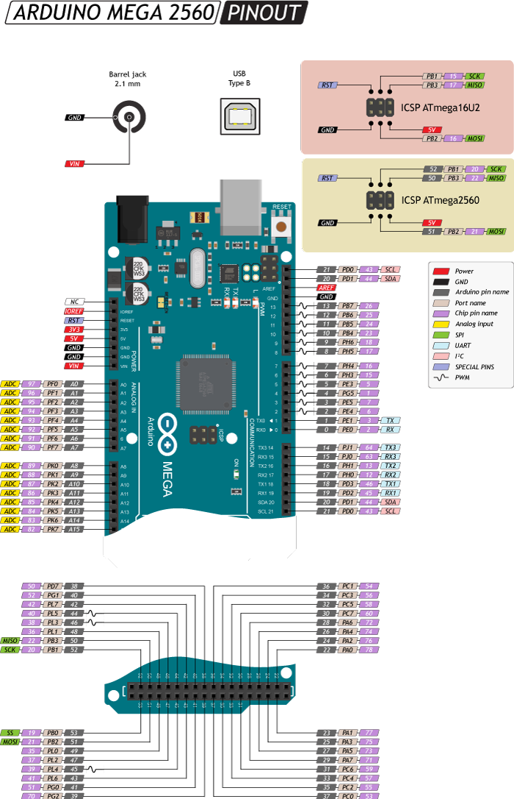

# Конфигурация платформы для MWOS

### Платформа: [ATMEGA2560](https://docs.platformio.org/en/stable/boards/atmelavr/megaatmega2560.html)

Характеристики:

- [ ] ATMEGA2560 (8bit, 5Volt) - 16MHz, USB, 256Kb ROM, 8Kb SRAM, 4Kb EEPROM, 54 programmable GPIOs (5 volt) 

## PINOUT:

