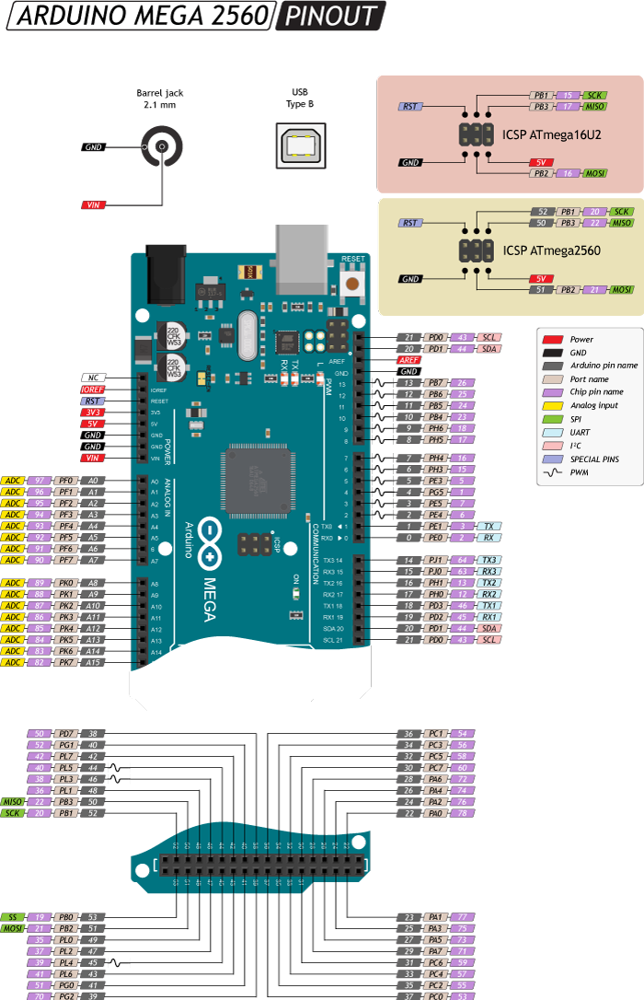

# 📋 Arduino Mega 2560

### Платформа: [Arduino Mega 2560](https://docs.platformio.org/en/stable/boards/atmelavr/megaatmega2560.html)

**Плюсы:** **полная 5 В логика на всех GPIO** (удобно для подключения периферии без сдвигов уровней), 54 цифровых GPIO (15 с PWM) + 16 аналоговых входов, 4×UART для одновременной работы с несколькими устройствами, огромная экосистема библиотек и примеров в Arduino IDE, простота программирования через USB, идеален для обучения, прототипирования, 3D-принтеров (Marlin), ЧПУ и проектов с большим количеством датчиков.

**Минусы:** Высокая цена, устаревшая 8-битная архитектура AVR с низкой производительностью (16 МГц), мало SRAM (8 КБ) — ограничение для сложных программ и строк, нет встроенного Wi-Fi/Bluetooth (требуется внешний модуль), нет OTA "из коробки", нет аппаратного шифрования, Flash 256 КБ (из них ~8 КБ под bootloader), нет USB OTG, большие габариты платы, высокое энергопотребление (~50 мА без нагрузки), нет глубокого sleep с сохранением RAM.

**Основные параметры:** ATmega2560 (AVR 8-bit RISC, 16 МГц), 8 КБ SRAM, 256 КБ Flash (4 КБ под загрузчик), 4 КБ EEPROM.

**Беспроводная связь:** Отсутствует встроенная; поддерживаются внешние модули (ESP-01, HC-05, NRF24L01, LoRa) через UART/SPI.

**Интерфейсы и GPIO:** 54 цифровых GPIO (15 PWM), 16 аналоговых входов (10-бит ADC), 4×UART (Hardware Serial), 1×SPI, 1×I2C (TWI), 1×USB (Device, через ATmega16U2/CH340), внешние прерывания на 6 пинах.

**Питание:** 7–12 В через разъём DC или 5 В через USB; рабочий диапазон 2.7–5.5 В; ток: ~50 мА без нагрузки, до 200–500 мА с периферией.

**Безопасность:** Нет аппаратного шифрования, защита только программная + fuse-биты.

**Особенности платы:** Кнопка RESET, разъём питания DC 2.1 мм, ICSP-разъёмы для AVR и USB-чипа, светодиод на пине 13, все GPIO выведены на штыревые разъёмы, совместимость с Arduino Shields, размер 101.5×53.3 мм.

**Примерная цена:** $8–10 (≈750–1000 ₽)

### Варианты исполнения

| Модель  | MCU | Flash | SRAM | EEPROM | Частота |
|---------|-----|-------|------|--------|---------|
| Mega 2560 | ATmega2560 | 256 КБ | 8 КБ | 4 КБ | 16 МГц |
| Mega 2560 Pro | ATmega2560 | 256 КБ | 8 КБ | 4 КБ | 16 МГц |

> 💡 **Примечание:** OTA возможно только с кастомным bootloader и внешним модулем памяти.

> ⚠️ **Важно:** Все GPIO Arduino Mega работают на 5 В логике и толерантны к 5 В. Пины 0/1 (RX0/TX0) используются для USB-коммуникации — не подключайте к ним периферию во время прошивки. Для работы с несколькими UART используйте Serial1–Serial3.
## PINOUT:

