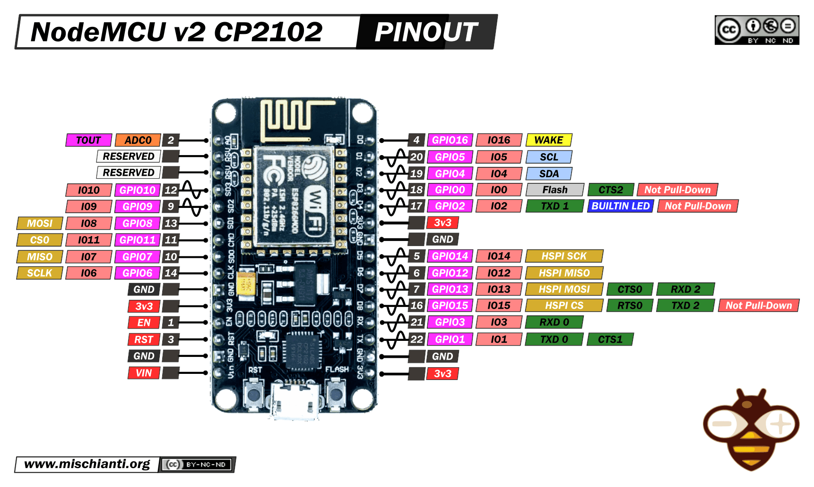

# 📋 NodeMCU v2

### Платформа: [NodeMCU v2](https://github.com/nodemcu/nodemcu-firmware)

### Рекомендуется по возможности заменить на ESP32-С3 или ESP32-C6

**Плюсы:** Отличное соотношение цены и качества, низкая стоимость, низкое энергопотребление (deep sleep ~20 мкА), встроенный Wi-Fi 802.11 b/g/n для IoT-приложений, простая программируемость через Arduino IDE или Lua, USB-to-UART преобразователь (CP2102/CH340) для удобной прошивки, компактные размеры, широкая поддержка сообщества, подходит для простых IoT-проектов и прототипирования.

**Минусы:** Только одно ядро (ограниченная многозадачность), низкая производительность CPU (80–160 МГц), мало памяти (64+96 КБ RAM), только 4 МБ Flash и нет PSRAM, нет Bluetooth, всего 10 GPIO выведено на плату, 10-бит ADC с одним каналом и низкой точностью, нет аппаратного шифрования и Secure Boot, GPIO не 5В tolerant, нет USB OTG, нет CAN/I2S/DAC, Wi-Fi может быть нестабилен при высокой нагрузке, устаревшая архитектура (2014), ограниченная поддержка новых библиотек.

**Основные параметры:** ESP8266EX (Tensilica Xtensa LX106, 80–160 МГц), 64 КБ instruction RAM + 96 КБ data RAM, Flash 4 МБ, 17 GPIO (10 выведено на плату).

**Беспроводная связь:** Wi-Fi 802.11 b/g/n (2.4 ГГц), антенна PCB.

**Интерфейсы и GPIO:** 10 GPIO (D0-D10), 1×UART, 1×I2C, 1×SPI, 1×10-бит ADC (A0, 0–1В или 0–3.3В), PWM (все GPIO), 1-Wire, 3.3 В выход.

**Питание:** 5 В USB или 4.5–10 В через VIN → 3.3 В (LDO); ток: TX ~250 мА, RX ~70 мА, deep sleep ~20 мкА.

**Безопасность:** WPA/WPA2, базовое шифрование Wi-Fi, нет аппаратного шифрования flash.

**Особенности платы:** кнопки RESET и FLASH для прошивки, USB-to-UART преобразователь (CP2102 или CH340), индикатор питания, PCB-антенна, компактный размер (58×32×12 мм, вес ~12–17 г).

**Примерная цена:** $1–3 (≈100–300 ₽) в зависимости от продавца и версии USB-чипа.

### Варианты исполнения и размер разделов в MWOS

| Модель  | Модуль | Flash  | PSRAM | app0 | littleFS | nvs | nvs1 |
|---------|--------|--------|-------|---------|----------|-----|------|
| V2-4MB  | ESP-12E | 4 МБ   | — | 1.81 МБ | 32 КБ | 192 КБ | 32 КБ |

> 💡 **Примечание:** NodeMCU v2 выпускается только с 4 МБ Flash и без PSRAM. Для 4 МБ Flash spiffs минимален (32 КБ). Рекомендуется использовать ESP32 для проектов с большим объёмом данных или сложной логикой.

## PINOUT:

