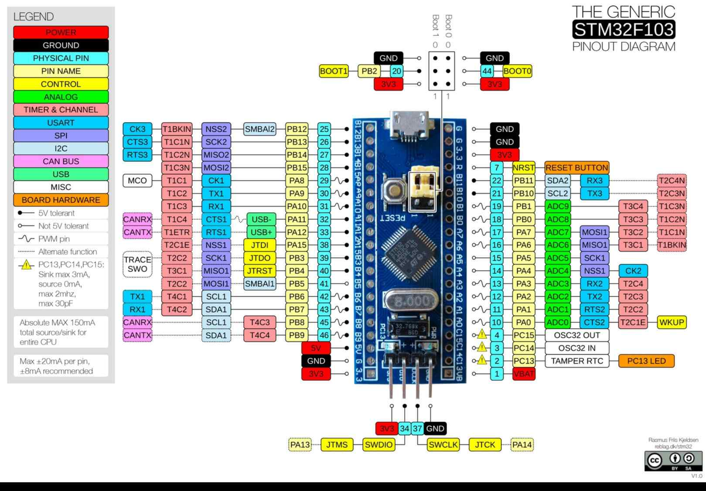

# 📋 Blue Pill (STM32F103C8T6)

### Платформа: [STM32F103C8T6 "Blue Pill"](https://wiki.stm32duino.com/index.php?title=Blue_Pill)

**Плюсы:** Низкая стоимость, низкое энергопотребление (standby ~2 мкА), ARM Cortex-M3 72 МГц для надёжной обработки, 20 КБ SRAM и 64–128 КБ Flash, богатый набор интерфейсов (SPI, I2C, USART, CAN, USB), 37 GPIO, 2×12-бит ADC + 2×DAC, аппаратные таймеры и PWM, **большинство GPIO совместимы с 5 В в режиме входа** (удобно для подключения 5-вольтовой периферии без уровневых сдвигов), широкая поддержка в Arduino IDE (STM32duino), PlatformIO и STM32CubeIDE, идеален для промышленной автоматики и обучения.

**Минусы:** Нет встроенного Wi-Fi/Bluetooth (требуется внешний модуль), нет OTA "из коробки", требуется ST-Link/JTAG для удобной прошивки (или bootloader через UART), меньше сообщество готовых библиотек vs ESP32, нет аппаратного шифрования, ADC требует точной настройки, чувствителен к качеству питания, совместимость с 5 В работает только в input-режиме (в output — только 3.3 В).

**Основные параметры:** STM32F103C8T6 (ARM Cortex-M3 32-bit, до 72 МГц), 20 КБ SRAM, Flash 64 КБ (C8) / 128 КБ (CB), нет PSRAM.

**Беспроводная связь:** Отсутствует встроенная; поддерживаются внешние модули (ESP-01, HC-05, NRF24L01, LoRa) через UART/SPI.

**Интерфейсы и GPIO:** 37 GPIO, 3×USART, 2×SPI, 2×I2C, 1×USB 2.0 FS (Device), 1×CAN, 2×12-бит ADC (10 каналов), 2×12-бит DAC, 7 таймеров, PWM, DMA, CRC.

**Питание:** 5 В USB или 3.3–5 В через VIN → 3.3 В (LDO); рабочий диапазон 2.0–3.6 В; ток: активный ~36 мА/МГц, sleep ~30 мкА, standby ~2 мкА.

**Безопасность:** Read-out protection (RDP), нет аппаратного шифрования (только программное AES).

**Особенности платы:** Кнопка RESET, BOOT0/BOOT1 для выбора режима загрузки, светодиод на PC13, кварц 8 МГц, компактный размер (53×23×10 мм), все GPIO выведены на штыревые разъёмы.

**Примерная цена:** $1–2 (≈80–200 ₽) в зависимости от продавца и версии Flash (C8/CB).

### Варианты исполнения 

| Модель  | MCU            | Flash |
|---------|----------------|-------|
| F103C8  | STM32F103C8T6  | 64 КБ |
| F103CB  | STM32F103CBT6  | 128 КБ |

> 💡**Примечание:** При необходимости OTA требуется кастомный bootloader.

> ⚠️ **Важно:** LED на PC13 активен низким уровнем (active-low). Для прошивки через UART: BOOT0=1, BOOT1=0, затем сброс. Для ST-Link: подключить SWDIO, SWCLK, GND, 3.3V. Большинство GPIO выдерживают 5 В **только в режиме входа** — в режиме выхода пин выдаёт 3.3 В.

## PINOUT:

