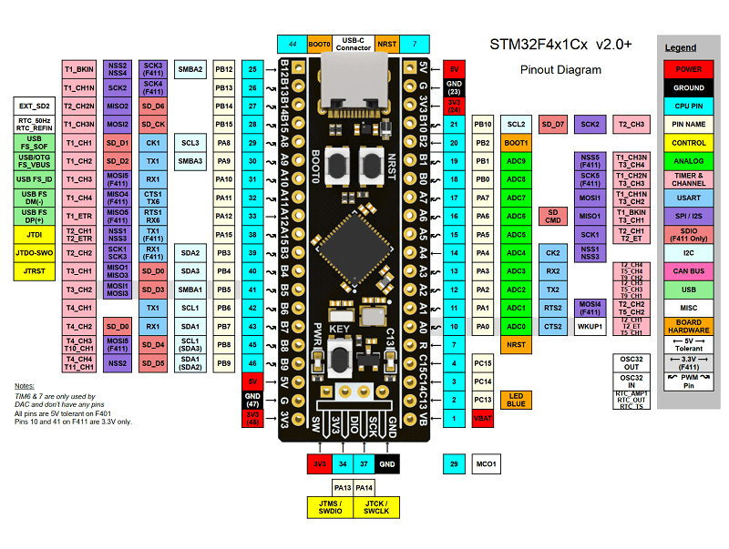

# 📋 Black Pill (STM32F401/F411)

### Платформа: [STM32F401/F411 Series](https://www.st.com/en/microcontrollers-microprocessors/stm32f4-series.html)

**Плюсы:** Низкая стоимость, низкое энергопотребление (standby ~2–3 мкА), ARM Cortex-M4F с FPU (до 100 МГц) для эффективной обработки с плавающей точкой, до 512 КБ Flash и 128 КБ SRAM, богатый набор интерфейсов (SPI, I2C, USART, USB OTG), ~30–50 GPIO, 1×12-бит ADC, аппаратные таймеры и PWM, **большинство GPIO совместимы с 5 В в режиме входа** (удобно для подключения 5-вольтовой периферии без уровневых сдвигов), широкая поддержка в Arduino IDE (STM32duino), PlatformIO и STM32CubeIDE, идеален для обучения, промышленной автоматики, DSP-задач и управления периферией.

**Минусы:** Нет встроенного Wi-Fi/Bluetooth (требуется внешний модуль), нет OTA "из коробки", требуется ST-Link/JTAG для удобной прошивки (или bootloader через UART), меньше сообщество готовых библиотек vs ESP32, нет аппаратного шифрования полного цикла, ADC требует точной настройки, чувствителен к качеству питания, совместимость с 5 В работает только в input-режиме (в output — только 3.3 В), нет CAN-интерфейса (в F401/F411), нет DAC (в F401).

**Основные параметры:** ARM Cortex-M4F 32-bit с FPU, частота 84–100 МГц, Flash 256–512 КБ, SRAM 64–128 КБ, нет PSRAM.

**Беспроводная связь:** Отсутствует встроенная; поддерживаются внешние модули (ESP-01, HC-05, NRF24L01, LoRa) через UART/SPI.

**Интерфейсы и GPIO:** ~30–50 GPIO (зависит от корпуса), 3×SPI, 3×USART, 3×I2C, 1×USB OTG FS (Device), 1×12-бит ADC (до 16 каналов), 10 таймеров, PWM, DMA, CRC, RTC.

**Питание:** 5 В USB или 3.3–5 В через VIN → 3.3 В (LDO); рабочий диапазон 1.7–3.6 В; ток: активный ~90–150 мкА/МГц, sleep ~100 мкА, standby ~2–3 мкА.

**Безопасность:** Read-out protection (RDP), нет полноценного аппаратного шифрования (только программное AES).

**Особенности платы:** Кнопка RESET, BOOT0 для выбора режима загрузки, светодиод на PC13, кварц 25 МГц (HSE), компактный размер (~36×22.5×8 мм для Black Pill), все GPIO выведены на штыревые разъёмы, USB-C или Micro-USB (зависит от ревизии).

**Примерная цена:** $1.2–6 (≈100–600 ₽) в зависимости от модели и продавца.

### Варианты исполнения

| Модель                                                                           | MCU | Flash | SRAM | Частота | Корпус | GPIO |
|----------------------------------------------------------------------------------|-----|-------|------|---------|--------|------|
| F401RC                                                                           | STM32F401RCT6 | 256 КБ | 64 КБ | 84 МГц | LQFP64 | ~50 |
| F401CE                                                                           | STM32F401CEU6 | 512 КБ | 96 КБ | 84 МГц | LQFP48 | ~30 |
| [F411CE](https://stm32-base.org/boards/STM32F411CEU6-WeAct-Black-Pill-V2.0.html) | STM32F411CEU6 | 512 КБ | 128 КБ | 100 МГц | LQFP48 | ~30 |

> 💡**Примечание:** При необходимости OTA требуется кастомный bootloader.

> ⚠️ **Важно:** LED на PC13 активен низким уровнем (active-low). Для прошивки через UART: BOOT0=1, затем сброс. Для ST-Link: подключить SWDIO, SWCLK, GND, 3.3V. Большинство GPIO выдерживают 5 В **только в режиме входа** (маркировка FT в datasheet) — в режиме выхода пин выдаёт 3.3 В.
> 

